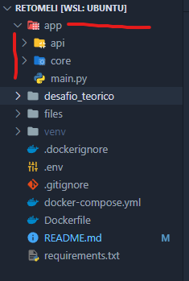

# MeliChallenge

# About the Project.


## Built With.

- Python 3.11
- Flask
- Docker

---

# Initializing Project.

## Pre-requisites

### Technologies Used.

- **Docker**

    [Get Started With Docker](https://www.docker.com/get-started/)

Everything will be executed inside docker, you dont need aditional instalations.

---

### Environment Vars.

The environment variables must be setted inside a **.env** file, inside the project a .env already exists, theres no need to create aditional **.env** files, you can modify the existing **.env** file.

The **.env** file will be public for the project purposes but in other projects it should be private.

- **MONGO_URI:** This variable is the connection to the mongo database, it is in this form so that it connects via docker, preferably leave as is
- **BASE_API_URL:** Variable used to store MeLi api address
- **FILE_NAME:** FILE_NAME must have the full path in this case as we are using docker must be like this: '/files/{name_of_file}' to work properly, and the file must be inside files folder.
- **SEPARATOR:** Separador de data en archivos de texto
- **ENCODING:** Encoding used in the text file
- **BATCH_SIZE:** Batch size used when reading the text file to process data in batches
- **THREADS_NUMBER:** Number of threads that will be used when querying the API to speed up the process

The values used in some test are the following:

| ENV_VAR | Value |
| --- | --- |
| **MONGO_URI** | mongodb://db/reto_meli |
| **BASE_API_URL** | https://api.mercadolibre.com/ |
| **FILE_NAME** | /files/technical_challenge_data.csv |
| **SEPARATOR** | , |
| **ENCODING** | utf-8 |
| **BATCH_SIZE** | 20 |
| **THREADS_NUMBER** | 20 |

---

# Execution of the Project Testing/Developing.

### Run with docker

Be sure you have docker installed, then open the console and type:

```sh
docker-compose up --build
```

This command will run the project, it means that docker will execute the mongo database and the project itself.

Once the docker container is up you can go ahead and try the endpoints.


## Endpoints


- ### [GET] localhost:8000/process

**This endpoint will execute the full program**, it will read the file and then do the requests to MeLi's API.

```sh
curl --location 'localhost:8000/process'
```

- ### [GET] localhost:8000/find_one/'id'

This endpoint will bring information if exists of saved items.

example:
```sh
curl --location 'localhost:8000/find_one/MLA828617220'
```
---

## Project Structure



The project itself is inside the app folder, we will found 2 folders and 1 file inside app folder.

- api (folder)
    - Here inside api folder we will found everything abount requests to api and our endpoints.

- core (folder)
    - Inside core folder we will found the files needed to process data, manage database, and constants.

- main.py (file)
    - This is the main file of the project, it will execute the connection to the database and raise the API.

By the other gand we have **files** **folder** that contains all the data in different formats.

# Contact

Alejandro Uribe - alejo.uribe35@gmail.com
