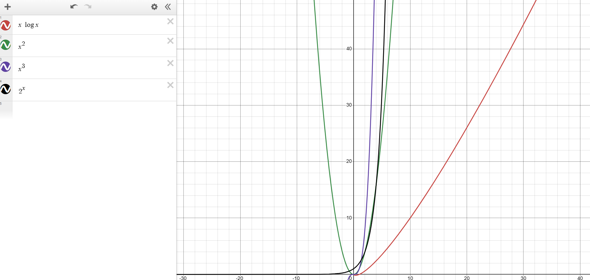

# Desafío Teórico

# Procesos, hilos y corrutinas.

- **Un caso en el que usarías procesos para resolver un problema y por qué.**

Podríamos usar procesos en una tarea que se pueda separar en tareas que sean independientes entre sí, entonces la tarea principal se dividiría en subprocesos que se encargarían de diferentes partes del código al tiempo.

- **Un caso en el que usarías threads para resolver un problema y por qué.**

Se podrían usar threads en tareas que requieran procesamiento de datos en paralelo, se podría usar en una aplicación que deba de realizar muchas peticiones a algún endpoint, entonces se podrían usar por ejemplo 30 hilos para hacer 30 peticiones simultaneamente y que el programa se demore mucho menos de lo que lo haría normalmente si no se implementan estos.

- **Un caso en el que usarías corrutinas para resolver un problema y por qué.**

Las corrutinas al poder ejecutarse en paralelo con otros procesos dan versatilidad a la hora de realizar diferentes cosas, por ejemplo se podrían usar en una aplicación que necesite descargar imágenes para enseñarlas, en vez de esperar a que cargue cada imágen se pueden usar corrutinas para realizar la descarga en paralelo y que la aplicación no se vea afectada por la carga de las mismas.

---

# Optimización de recursos del sistema operativo.

- **Si tuvieras 1.000.000 de elementos y tuvieras que consultar para cada uno de ellos información en una API HTTP. ¿Cómo lo harías? Explicar**

Primero buscaría la forma de obtener la mayor cantidad de elementos de una request, para esto el servicio debería de aceptar algún tipo de multiget, así no se harían 1’000.000 de peticiones si no que se acortaría, habría que mirar los recursos con los que cuento para ver si es necesario un procesamiento por lotes, de todas formas sería mejor hacerlo por lotes dado al tamaño de lo que se quiere consultar, se podrían usar hilos (threads) si se quiere realizar el proceso más rápido ya que consultar 1’000.000 de elementos de 1 a 1 se tardaría mucho si no se tiene un multiget. Al tratarse de tantos archivos tampoco queremos que se consulten archivos dos veces por lo que se podría implementar un sistema de caché que guarde los archivos ya consultados. Se podría ver de la siguiente forma:

- Analizar el endpoint de consulta para tomar decisiones de diseño de programa.
- Ver si con los recursos que cuento puedo realizar el proceso de 1’000.000 de datos o habría que realizarlo por lotes.
- Verificar viabilidad de uso de hilos (threads) a la hora de realizar las peticiones para que el proceso no demore mucho.
- Implementar sistema de caché que guarde elementos ya consultados.

---

# Análisis de complejidad.

- **Dados 4 algoritmos A, B, C y D que cumplen la misma funcionalidad, con
complejidades $O(n^2)$, $O(n^3)$, $O(2^n)$ y $O(n\log n)$, respectivamente, ¿Cuál de los
algoritmos favorecerías y cuál descartarías en principio? Explicar por qué.**

Para datasets pequeños por lo general la complejidad algorítmica no importa mucho a menos que nos encontremos con una complejidad exponencial, me refiero a $O(2^n)$, por lo que sería la primera en descartar, es una función que crece extremadamente rápido y puede hacer que nuestro programa sea imposible de ejecutar, por lo general lo podemos ver en algoritmos de backtracking o varios algoritmos de lógica para ciencias de la computación ya que no son muy eficientes, por ejemplo, DPLL, el problema de la 8 reinas etc. Posteriormente se descartaría $O(n^3)$ ya que es el siguiente en orden de complejidad. El primero en favorecer sería $O(n\log n)$ ya que es más eficiente que $O(n^2)$, no obstante $O(n^2)$ no es para nada malo, ya que varios algoritmos de ordenamiento se ejecutan en ese tiempo, por lo general siempre se quiere llegar a $O(n^2)$ o menos en cualquier algoritmo que se plantee. También podemos ver el tema de complejidad como funciones, para esto agregaré una imagen que los represente.

En la anterior imagen podemos ver cómo se comportan las funciones anteriormente nombradas, notarán que el mejor rendimiento lo tiene $n \log n$, y posteriormente le sigue $n^2$, también vemos un comportamiento extraño con las otras 2 funciones porque $n^3$ empieza siendo más ineficiente, pero a medida que hay más datos realmente $2^n$ termina siendo más ineficiente.

- **Asume que dispones de dos bases de datos para utilizar en diferentes
problemas a resolver. La primera llamada AlfaDB tiene una complejidad de $O(1)$
en consulta y $O(n^2)$ en escritura. La segunda llamada BetaDB que tiene una
complejidad de $O(n\log n)$ tanto para consulta, como para escritura. ¿Describe en
forma sucinta, qué casos de uso podrías atacar con cada una?**

Teniendo en cuenta que AlfaDB tiene tiempo constante en consulta y cuadrático en escritura deberíamos aprovechar lo eficiente que es al leer datos, por lo que debería usarse en algún problema que requiera poca escritura y mucha lectura de datos, puede ser por ejemplo en algún negocio en una página web que tenga muchísimos clientes y no tenga tantos productos, de todas formas que tenga o no muchos productos no afecta mucho pero los datos se traerían en un tiempo extremadamente rápido por la eficiencia en lectura que tiene la base de datos AlfaDB, al subir un nuevo producto tampoco se demoraría mucho ya que no es un tiempo muy grande pero es mucho mejor para el vendedor que puedan ver sus productos rápidamente.

Para el caso de BetaDB como tiene la misma complejidad en lectura y escritura se podría usar para ver datos en tiempo real, podría por ejemplo usarse en una página de noticias, en donde los datos tengan rapidez al insertarse y al leerse, al contar con un tiempo lineal-logarítmico podemos contar con una fluidez aceptable al publicar y leer contenido nuevo.